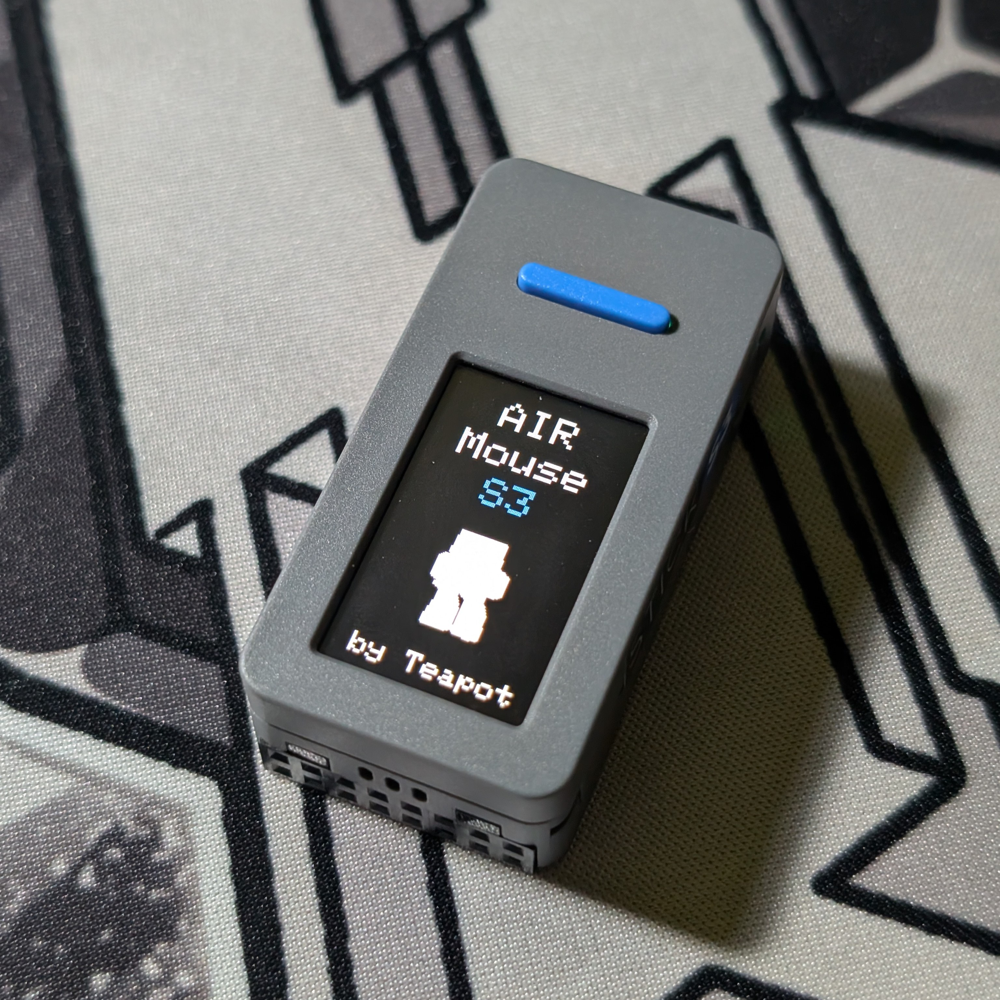
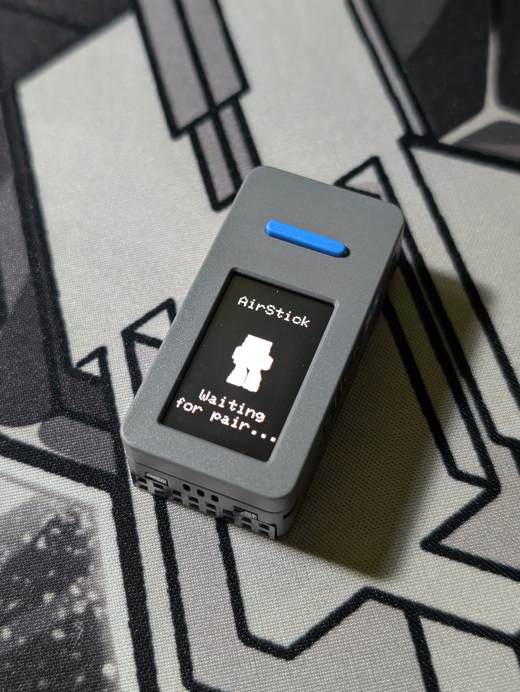
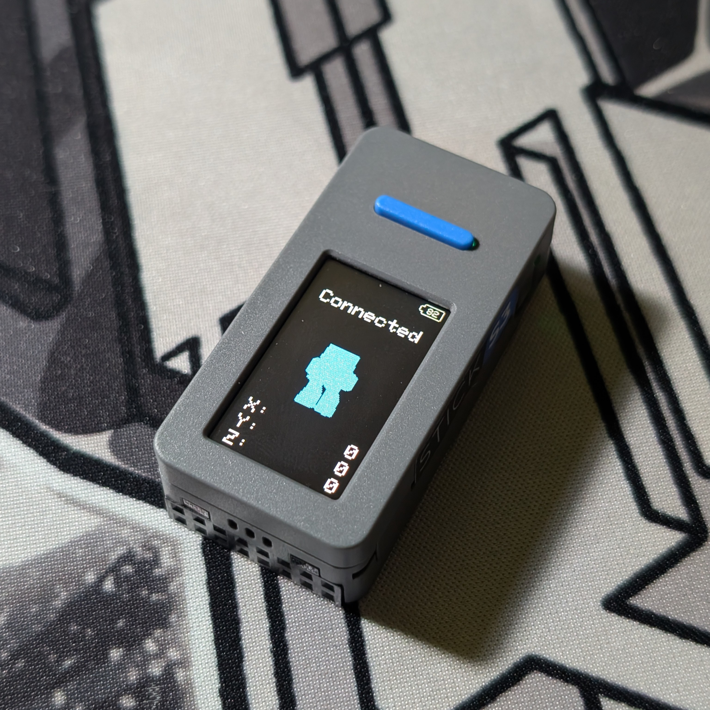

# AirMouseS3


## About
A computer mouse that uses a gyroscope and accelerometer, based on the StickS3.

Can be connected to any device via Bluetooth.

## Flash & Setup
Find «AirMouseS3» in [M5Burner](https://docs.m5stack.com/en/uiflow/m5burner/intro) and burn your StickS3.


Connect to the AirStick Bluetooth hotspot and use.

## Buttons
BUTTON A — LMB

BUTTON B — Freezes movement to straighten the stick if the cursor moves.

## Pictures




## Build ([esptool.exe](https://github.com/espressif/esptool/releases/tag/v5.2.0))

```
esptool.exe --chip esp32s3 merge_bin -o AirMouseS3.bin 0x0 bootloader.bin 0x8000 partitions.bin 0x10000 firmware.bin
```
